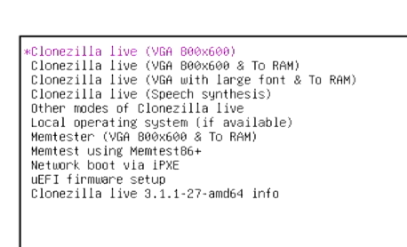
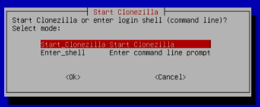
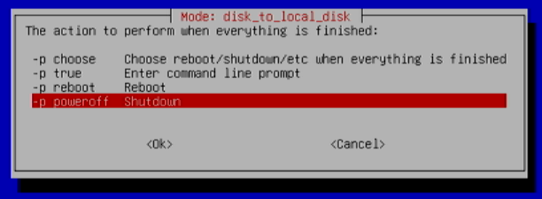
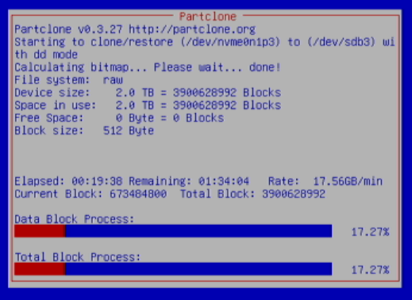

# Guide on How to Migrate to a Larger Disk for an Ethereum Validator

Disk usage is a constant concern for stakers and node operators. The blockchain data keeps growing each day with new transactions and states to store. Stakers and node operators are mainly those responsible for storing this data. During the life of a staker or a node operator, it is likely that you will need more space for this concern. Migrating to a larger disk might become the last solution for some.

This guide is meant for people with little or no experience migrating to a larger disk. It will show you step by step how to check your disk usage, which solutions are possible to manage disk usage, which tools you will need to migrate to a larger disk, and the process of migrating to a larger disk. It will assume you are using a modern Linux distribution to run your staker or node operating system. Many of these instructions and steps are possible on Windows or macOS, but this is out of scope for this guide.

A video tutorial of this guide can be seen on https://youtu.be/xWyf84Syq7o .

If you know what you are doing, you can simply read the [Migrating to a Larger Disk](#migrating-to-a-larger-disk) section.

## Current Expected Disk Usage

On Mainnet, you should expect the current disk usage to be around **1 TB to 1.7 TB**, depending on which client and configuration you are using, excluding archive nodes. This should be accurate as of today, January 2024. It might be possible to still use a 1 TB disk in some extremely specific scenarios, but any serious staker or node operator should be using a good 2+ TB SSD. If you are building a new machine, you should consider buying or starting with a good 4 TB SSD to avoid having to perform this kind of maintenance in the short or medium term.

## Solutions to Check Before Buying a New Disk and Migrating

I recommend running ncdu has described below as the first step to figure out exactly which application or directory is consuming the most disk space. A common low-hanging fruit is to [resync your consensus client with a checkpoint sync endpoint](#updating-and-resyncing-from-scratch) especially if it has been a while since your last resync. If your consensus client is using way more than around 110 GB of disk space, you will likely benefit from this resync. If your execution client is using way more than 1.0 TB of disk space, there are ways to improve described below.

### Checking Your Current Disk Usage

On Linux, you can run `df -h` to find out more about filesystem disk usage. It will return something like this:

```
Filesystem                         Size  Used Avail Use% Mounted on
tmpfs                              1.6G  2.6M  1.6G   1% /run
/dev/mapper/ubuntu--vg-ubuntu--lv  913G  378G  489G  44% /
tmpfs                              7.6G     0  7.6G   0% /dev/shm
tmpfs                              5.0M     0  5.0M   0% /run/lock
/dev/nvme0n1p2                     2.0G  375M  1.5G  21% /boot
/dev/nvme0n1p1                     1.1G  6.4M  1.1G   1% /boot/efi
tmpfs                              1.6G  4.0K  1.6G   1% /run/user/1000
```

In this example, you can see the root mount `/` is the main one with 913 GB of total disk space, of which 378 GB is used, leaving 489 GB of free disk space.

On Linux, you can run `sudo fdisk -l` to find out more about your disks and partitions. It will return something like:

```
Disk /dev/nvme0n1: 931.51 GiB, 1000204886016 bytes, 1953525168 sectors
Disk model: WDS100T3X0C-00SJG0
Units: sectors of 1 * 512 = 512 bytes
Sector size (logical/physical): 512 bytes / 512 bytes
I/O size (minimum/optimal): 512 bytes / 512 bytes
Disklabel type: gpt
Disk identifier: XXX

Device           Start        End    Sectors   Size Type
/dev/nvme0n1p1    2048    2203647    2201600     1G EFI System
/dev/nvme0n1p2 2203648    6397951    4194304     2G Linux filesystem
/dev/nvme0n1p3 6397952 1953521663 1947123712 928.5G Linux filesystem


Disk /dev/mapper/ubuntu--vg-ubuntu--lv: 928.46 GiB, 996923146240 bytes, 1947115520 sectors
Units: sectors of 1 * 512 = 512 bytes
Sector size (logical/physical): 512 bytes / 512 bytes
I/O size (minimum/optimal): 512 bytes / 512 bytes
```

In this example, you can see a single SSD on `/dev/nvme0n1` with a 931.51 GiB size and a few partitions.

On Linux, if you have ncdu installed (it can be installed with `sudo apt install ncdu` on any Debian-related distro), you can run `sudo ncdu -x -q /` to get some great insights into which directory and which application is using the most disk space. You can interactively browse into the larger directories to figure out which subdirectories are using most of your disk space. It will return something like:

```
ncdu 1.15.1 ~ Use the arrow keys to navigate, press ? for help
--- / --------------------------------------------------------------------------
    1.0 TiB [##########] /var
    8.0 GiB [          ] /home
    4.0 GiB [          ]  swap.img
    3.8 GiB [          ] /usr
    6.2 MiB [          ] /etc
    2.3 MiB [          ] /root
  104.0 KiB [          ] /tmp
   36.0 KiB [          ] /snap
e  16.0 KiB [          ] /lost+found
e   4.0 KiB [          ] /srv
e   4.0 KiB [          ] /opt
e   4.0 KiB [          ] /mnt
e   4.0 KiB [          ] /media
@   0.0   B [          ]  libx32
@   0.0   B [          ]  lib64
@   0.0   B [          ]  lib32
@   0.0   B [          ]  sbin
@   0.0   B [          ]  lib
@   0.0   B [          ]  bin
>   0.0   B [          ] /sys
>   0.0   B [          ] /run
```

Browsing into `/var/lib` will reveal how much disk space subdirectories in that directory are using:

```
ncdu 1.15.1 ~ Use the arrow keys to navigate, press ? for help
--- /var/lib -------------------------------------------------------------------
                         /..
  929.4 GiB [##########] /goethereum
   64.7 GiB [          ] /lighthouse
    1.1 GiB [          ] /prometheus
    1.0 GiB [          ] /snapd
  164.6 MiB [          ] /apt
   32.9 MiB [          ] /dpkg
    3.2 MiB [          ] /command-not-found
    3.1 MiB [          ] /ubuntu-advantage
    1.5 MiB [          ] /grafana
    1.1 MiB [          ] /fwupd
  704.0 KiB [          ] /usbutils
  612.0 KiB [          ] /systemd
  208.0 KiB [          ] /cloud
  124.0 KiB [          ] /ucf
   40.0 KiB [          ] /polkit-1
   36.0 KiB [          ] /PackageKit
   28.0 KiB [          ] /pam
   20.0 KiB [          ] /update-notifier
   16.0 KiB [          ] /grub
   12.0 KiB [          ] /update-manager
```

In this example, you can see that Geth is using 929.4 GiB, and Lighthouse is using 64.7 GiB since they were configured to store their databases under `/var/lib`.

On linux, you can run `lsblk` to list your block devices in a tree-like format. It will return something like this:

```
NAME                      MAJ:MIN RM   SIZE RO TYPE MOUNTPOINTS
loop0                       7:0    0  63.4M  1 loop /snap/core20/1974
loop1                       7:1    0  63.9M  1 loop /snap/core20/2105
loop2                       7:2    0 111.9M  1 loop /snap/lxd/24322
loop3                       7:3    0 114.4M  1 loop /snap/lxd/26741
loop4                       7:4    0  53.3M  1 loop /snap/snapd/19457
loop5                       7:5    0  40.4M  1 loop /snap/snapd/20671
nvme0n1                   259:0    0   1.8T  0 disk
├─nvme0n1p1               259:1    0     1G  0 part /boot/efi
├─nvme0n1p2               259:2    0     2G  0 part /boot
└─nvme0n1p3               259:3    0   1.8T  0 part
  └─ubuntu--vg-ubuntu--lv 253:0    0   1.8T  0 lvm  /
```

In this example, you can see the only disk being `nvme0n1` with 3 partitions and a logical volume using LVM.

### Pruning

Some clients like Geth and Nethermind support pruning your existing database to lower its disk usage. The general idea is that these clients accumulate data that can be removed with a manual or automatic process.

With **Geth**, if you are still using [the default hash state scheme](https://blog.ethereum.org/2023/09/12/geth-v1-13-0), you will accumulate *unneeded* data over time. You will need to stop Geth, [perform a manual process to prune its database](https://gist.github.com/yorickdowne/3323759b4cbf2022e191ab058a4276b2), and restart it to remove this junk. During this time, your node will be offline, and staking penalties will start accruing. [The rescue node project](https://rescuenode.com/docs/) can be a good solution for stakers to prevent or lower downtime and penalties. Pruning Geth also needs around 80 GB of free space to begin with on Mainnet. If you don't have that free space, you could try to delete your consensus client database to make enough room for it and resync your consensus client using [a checkpoint sync endpoint](https://eth-clients.github.io/checkpoint-sync-endpoints/). The new [path state scheme (PBSS)](#resyncing-with-a-different-configuration) is an interesting configuration alternative for long-term low disk usage.

With **Nethermind**, you have [different configurations that enable online pruning](https://docs.nethermind.io/fundamentals/pruning) where your client is still able to serve its normal operation and clean its database at the same time. There is a manual process where you can trigger the pruning process. There is one based on a database size threshold. There is one based on a remaining storage space threshold. In any case, you are going to need around 230 GB of free space to begin that pruning process on Mainnet. A good strategy is to set the automatic pruning configuration to trigger when you are slightly above that 230 GB of remaining free space. This implies that you are effectively reserving that space exclusively for pruning.

With **Lighthouse**, you can [prune historic states](https://lighthouse-book.sigmaprime.io/database-migrations.html#how-to-prune-historic-states) if you synced your beacon node before version 4.4.1.

### Updating and Resyncing from Scratch

Clients implement improvements over time to their disk usage strategy. Updating your client and resyncing from scratch can not only remove the *unneeded* data that was accumulated over time, but it can also enable your client to use better ways of storing that data to use less disk space. For execution clients, you are likely going to experience some extended downtime (a few hours to a few days). [The rescue node project](https://rescuenode.com/docs/) can be a good solution for stakers to prevent or lower downtime and penalties. For consensus clients, you can often use [a checkpoint sync endpoint](https://eth-clients.github.io/checkpoint-sync-endpoints/) to resync from scratch in a few minutes for minimal downtime.

For example, Lighthouse beacon nodes that were synced before version 4.4.1 have [historic states](https://lighthouse-book.sigmaprime.io/database-migrations.html#how-to-prune-historic-states) that are no longer needed. Performing the prune-states command or resyncing from scratch will drastically lower disk usage.

### Resyncing with a Different Configuration

Clients often have a large number of configuration options that can influence disk usage.

With **Geth**, starting with version 1.13.0, you can use [a Path Based Storage Scheme (PBSS)](https://blog.ethereum.org/2023/09/12/geth-v1-13-0) to avoid storing unnecessary data in your database. This new storage scheme is not enabled by default, and it is not considered production-ready yet. However, since it has a good impact on current disk usage, on long-term disk usage, and on avoiding the pruning maintenance task, many stakers and node operators are using it on Mainnet. You will need to resync from scratch if you want to use this configuration alternative. During this time, your node will be offline, and staking penalties will start accruing. [The rescue node project](https://rescuenode.com/docs/) can be a good solution for stakers to prevent or lower downtime and penalties.

With **Nethermind**, the development team is exploring [3 approaches to improve disk usage: Paprika, Path-Based Storage, and Half-path](https://medium.com/nethermind-eth/nethermind-client-3-experimental-approaches-to-state-database-change-8498e3d89771). As of today, January 2024, it seems like those approaches are all experimental, but we should keep an eye on them. Version 1.26.0 should include Half-path. It will become the default sync mode for new nodes or resyncs.

### Migrating to a Different Client

Different clients and configurations can lead to lower disk usage. Migrating from a client that does not have a great disk usage strategy to one that does can help with the disk usage concern. As of today, January 2024, Geth with PBSS is one of the best execution clients and configurations in terms of disk usage. Using the Geth client as a majority choice poses a significant risk to your stake and negatively impacts the overall health of the network.

### Using Multiple Disks

If your machine supports installing multiple good SSDs and your system is configured to enable extending your partitions or volumes easily, such as [with LVM](https://www.cyberciti.biz/faq/howto-add-disk-to-lvm-volume-on-linux-to-increase-size-of-pool/), adding another disk can be an interesting alternative to migrating to a larger disk. This approach can limit the downtime it takes to gain more disk space. It has a con in terms of larger risks coming from a disk failure. Your new machine will now fail if either one of your disks fails instead of the risk coming from a single disk. Using various [RAID setups](https://en.wikipedia.org/wiki/RAID) can help alleviate the risks from disk failures in a multiple disks configuration, but it's probably overkill for home stakers and home node operators. RAID setups are out of scope for this guide.

### Monitoring and Alerting

A good practice is to install and configure [monitoring](monitoring.md) and [alerting](alerting.md) tools to watch your machine's free disk space.

## Migrating to a Larger Disk

The general idea to migrate to a larger disk is simple.

1. Stop your staking or node machine.
2. Plug both disks into the same machine (it can be the same staking or node machine, or it can be another one).
3. Boot into a live OS or a tool to perform the copy.
4. Extend your volumes, your partitions and your filesystems on the new larger disk to be able to use the full capacity.
5. Plug the larger disk into your staking or node machine and restart that machine.

From there, your machine should simply work as it did before with more disk space for its operations. Extending your volumes, partitions and filesystems (step 4) can be performed during the copying step, after the copying step, or even after restarting your staking or node machine.

### Requirements

You will need a machine where you can plug both disks at the same time. If you don't have enough room for both SSDs, you can buy an adapter like one you plug into a USB port. You will need a USB stick to put your live OS or tools on. Tools and general support to perform this on the Apple M1, M2 or M3 platform is limited. [Asahi Linux](https://asahilinux.org/) and their derivative work might be useful instead of using Clonezilla. Various [native Apple software](https://appleinsider.com/inside/mac/best/best-disk-clone-software-for-mac) could also work. We will focus on using an amd64 platform to perform the migration for this guide.

There are commercial software alternatives to using [Clonezilla](https://clonezilla.org/) (EaseUS Todo Backup, Macrium Reflect, Acronis Cyber Protect Home Office, AOMEI Backupper, etc) for disk cloning. The main pros of using Clonezilla are that it is free and open source. The cons of using Clonezilla include limited support and a text-based user interface. [Rescuezilla](https://rescuezilla.com/) is a nice GUI on top of Clonezilla if you are intimidated by the text-based user interface.

### Preparing your USB stick

This can be done on any machine connected to the Internet.

1. Use an empty USB stick or a USB stick that does not contain any important document. Plug it in.
2. Download [the latest stable release of Clonezilla Live](https://clonezilla.org/downloads.php). The ISO version for amd64 CPU architecture is likely what you will want.
3. Download [Rufus](https://rufus.ie/en/) (On Windows) or [balena Etcher](https://etcher.balena.io/) (On macOS or Linux) to create your bootable USB stick.
4. Run Rufus or balena Etcher, select the Clonezilla Live archive you downloaded at step 2 and select your USB stick. Create your bootable USB stick by following the software instructions.

### Copying the content on the larger disk

1. Stop the machine you want to use to perform the disk copy.
2. Plug in both SSDs in the same machine.
3. Plug in your bootable USB stick.
4. Boot your machine using the USB stick image and OS. The actual instructions to boot onto a USB stick will vary from machine to machine.

There are some common keyboard keys that are often used during the boot process to access the boot menu or BIOS/UEFI settings where you can choose the boot device. Here are a few possibilities:

- F2 or Del: On many systems, pressing the F2 key or the Del key during the initial startup process will take you to the BIOS or UEFI settings. From there, you can navigate to the Boot menu and select the USB drive as the boot device.
- F12 or Esc: Some systems use the F12 key or the Esc key to directly access the boot menu during startup. Pressing either of these keys should bring up a menu where you can choose the USB drive as the boot option.
- F10 or F9: On certain computers, the F10 or F9 key might be used to access the Boot menu directly during startup.
- ESC or Tab: In some cases, pressing the ESC key or the Tab key during startup may display a boot menu where you can select the USB drive.

Keep in mind that the exact key and the process can vary, so it's recommended to check your computer's manual or look for on-screen prompts during startup. If you're still unsure, you can provide the make and model of your computer, [we can try to find it for you](#support).

5. From the live OS or tool you installed on the USB stick, select to copy or clone from a local disk to another local disk. If you are using Clonezilla, there is also an option to extend the new partitions to use all the available space (`-k1` *Create partition table proportionally*). Enable that option.

When booting from the Clonezilla Live you can choose the default option, *Clonezilla live (VGA 800x600)*.



Start the regular text-based user interface by choosing the default option, *Start Clonezilla*.



Select the *device-device* mode to clone a full disk to another one.


Choose the *Beginner* mode for advanced parameters.


Select the *disk_to_local_disk* clone mode.


Select your small disk as the source disk.


Select your larger disk as the target disk.


You can select the *-sfsck* option to skip checking/repairing the source file system.


If you want to automatically expand your partitions, select the *-k1* option to *Create partition table proportionally* on the larger disk. If you do not select this option, you will need to manually expand your partitions afterwards.


Finally, you can select an action to be performed when Clonezilla is done with its task.



Once you answer all these questions, you will be asked to confirm everything. As Clonezilla perform the disk clone, you will see a progress dialog displaying an estimate of the remaining time.



6. Wait for the cloning process to complete. This can take a few hours depending on the copying speed.
7. Shut down the machine.
8. Remove both SSDs.

### Restarting your machine

Once all the data is copied onto that larger SSD, plug that larger disk into your staking or node machine. Restart that machine and you should be good to go.

### Resizing your volumes with LVM

[LVM](https://en.wikipedia.org/wiki/Logical_volume_management) adds a few interesting features and it is the default option when installing and configuring a new Ubuntu 22.04 system. It also adds some complexity when migrating to a larger disk. If you are using LVM, you will need to resize your physical volume, you will need to extend your logical volume and you will likely need to resize your filesystem. This can be done after rebooting on your larger disk while it is running. This can be done with these commands:

```console
sudo pvresize [physical volume path]
sudo lvextend -l +100%FREE --resizefs [logical volume path]
```

where `[physical volume path]` is replaced with your physical volume path and `[logical volume path]` is replaced with your logical volume path.

Here is a concrete example of using this command.

```console
sudo pvresize /dev/nvme0n1p3
sudo lvextend -l +100%FREE --resizefs /dev/ubuntu-vg/ubuntu-lv
```

You can list all your system physical volumes, volume groups and logical volumes including their paths with `sudo vgdisplay -v`. Including the `--resizefs` flag with the `lvextend` command above will automatically resize the underlying filesystem meaning that you can skip the next section.

### Resizing your filesystem

Some filesystems will need to be resized in order to account for their underlying partition size change. If you are using [ext4](https://en.wikipedia.org/wiki/Ext4) which is common on Linux, you can simply execute `sudo resize2fs [filesystem device]` where `[filesystem device]` is replaced with your filesystem device path. You can list all the filesystems and their type with `df -T` to obtain your filesystem device path. This can be done after rebooting on your larger disk while it is running.

Here is a concrete example of using this command.

```console
sudo resize2fs /dev/ubuntu-vg/ubuntu-lv
```

## What's next?

Once you confirm that the larger SSD works fine, you should format and erase all the data from your smaller disk especially if you are running a staking machine. The main concern is running both of these disks at the same time and potentially creating a slashing event.

## Support

If you have any question or if you need additional support, make sure to get in touch with the ethstaker community on:

* Discord: [dsc.gg/ethstaker](https://dsc.gg/ethstaker)
* Reddit: [reddit.com/r/ethstaker](https://www.reddit.com/r/ethstaker/)
